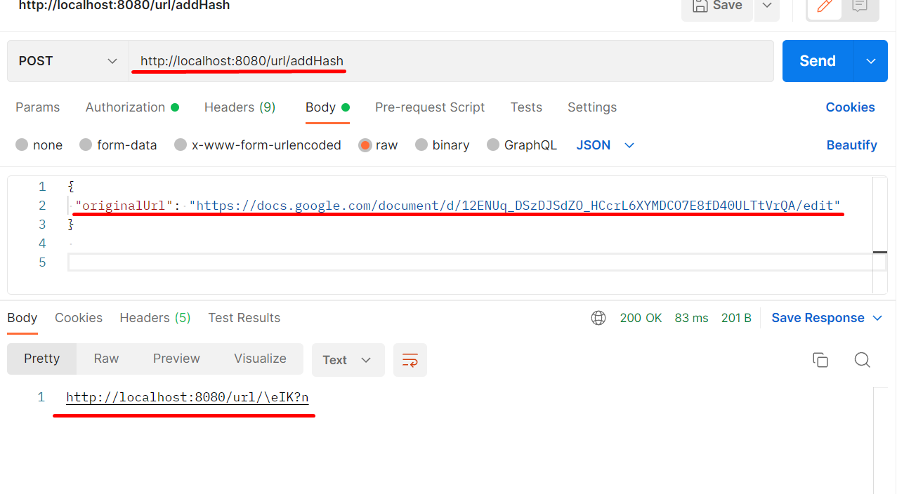
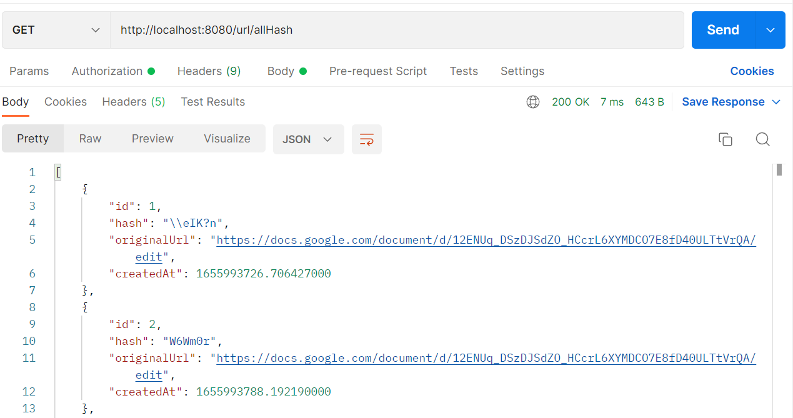
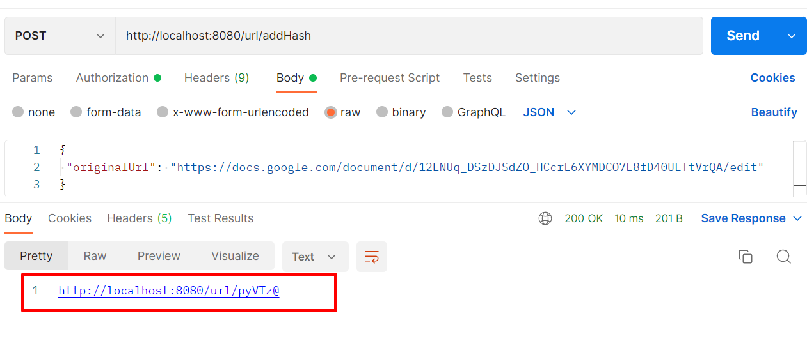

#Работал в postman

1.Запуск приложухи

2.Через postman отправляю post запрос с оригинальной ссылкой:

3.Что бы просмотреть все ссылки которые есть в бд:

4.Для перехода с помощью короткой ссылки сервер возвращает:

Да, короткая ссылка будет работать только во время работы
приложения, так как короткая ссылка привязана к 
оригиналу через бд.

Так же добавил swagger, удобнее смотреть 
какие есть методы запросов 
"http://localhost:8080/swagger-ui.html"
